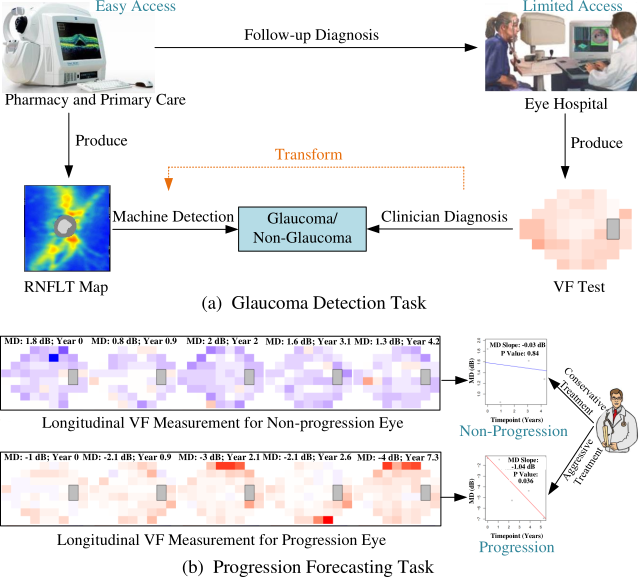

# Pseudo Supervisor

This is the code for the paper titiled *Generalization-Reinforced Semi-Supervised Learning for Glaucoma Detection and Progression Forecasting and a New Multimodal and Multitask Dataset*.

# Abstract

<p align="center">

</p>

Glaucoma is the number one cause of irreversible blindness globally. A major challenge for accurate glaucoma detection and progression forecasting is the bottleneck of limited labeled patients with the state-of-the-art (SOTA) 3D retinal imaging data of optical coherence tomography (OCT). To address the data scarcity issue, this paper proposes two solutions. First, we develop a novel generalization-reinforced semi-supervised learning (SSL) model called pseudo supervisor to optimally utilize unlabeled data. Compared with SOTA models, the proposed pseudo supervisor optimizes the policy of predicting pseudo labels with unlabeled samples to improve empirical generalization. Our pseudo supervisor model is evaluated with two clinical tasks consisting of glaucoma detection and progression forecasting. The progression forecasting task is evaluated both unimodally and multimodally. Our pseudo supervisor model generally demonstrates superior performance than SOTA SSL comparison models. Second, we release a multimodal and multitask dataset including 1,000 patients with OCT imaging data and glaucoma labels and progression labels. This is the largest glaucoma detection dataset with 3D OCT imaging data and the first glaucoma progression forecasting dataset that are publicly available.

# Requirements

To install the prerequisites, run:

```
pip install - r requirements.txt
```


# Experiments

To run the experiments on the task of glaucoma detection, run:

```
./glaucoma_detection_training.sh
```

To run the experiments on the task of progression forecasting, run:

```
./progression_forecasting_training.sh
```

# Dataset Sharing

To the best of our knowledge, existing file hosting services, such as Dropbox/Google Drive/OneDrive, contain the information of ownership. This breaks the anonymity requirements for the double blind review process. Therefore, we will release the dataset after the peer review process. 